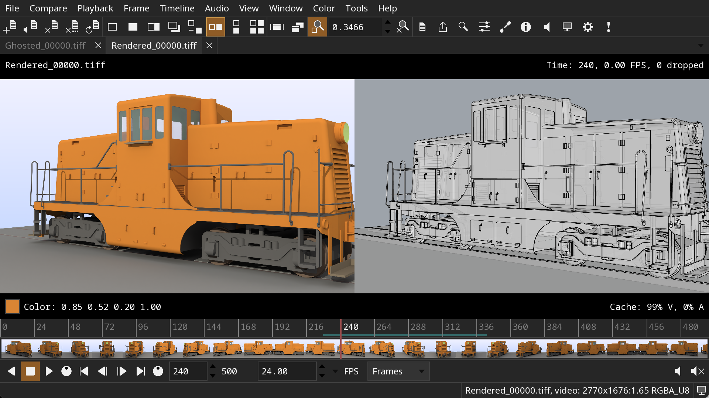

[](https://opensource.org/licenses/BSD-3-Clause)
[](https://github.com/darbyjohnston/DJV/actions/workflows/ci-workflow.yml)

#  DJV

DJV is an open source application for playback and review of image
sequences. DJV can playback high resolution image sequences in real
time, with audio, A/B comparison, and color management.

Features include:
* Support for high resolution and high bit depth images
* A/B comparison with wipe, overlay, and difference modes
* Timeline support with OpenTimelineIO
* Color management with OpenColorIO
* Multi-track audio with variable speed and reverse playback
* Experimental support for USD files
* Available for Linux, macOS, and Windows

[Documentation](https://darbyjohnston.github.io/DJV/index.html)

DJV is built with the [tlRender](https://github.com/darbyjohnston/tlRender) library.

Example of two images being compared with a wipe:


Example of two images being compared with a horizontal layout:




## Downloads

**NOTE**: Download packages only include a minimal set of video codecs. To
enable full support for video codecs, either compile from source or replace
the FFmpeg shared library files.


## Building on Linux

Dependencies:
* CMake 3.31

Install system packages (Debian based systems):
```
sudo apt-get install xorg-dev libglu1-mesa-dev mesa-common-dev mesa-utils libasound2-dev libpulse-dev
```

Install system packages (Rocky 9):
```
sudo dnf install libX11-devel libXrandr-devel libXinerama-devel libXcursor-devel libXi-devel mesa-libGL-devel pipewire-devel
```

Clone the repository:
```
git clone https://github.com/darbyjohnston/DJV.git
```

Run the super build script:
```
sh DJV/SuperBuild_Linux.sh
```

Run the application:
```
build-Release/bin/djv/djv DJV/etc/SampleData/BART_2021-02-07.0000.jpg
```


## Building on macOS

Dependencies:
* Xcode
* CMake 3.31

Clone the repository:
```
git clone https://github.com/darbyjohnston/DJV.git
```

Run the super build script:
```
sh DJV/SuperBuild_macOS.sh
```

Run the application:
```
build-Release/bin/djv/djv DJV/etc/SampleData/BART_2021-02-07.0000.jpg
```

These aliases are convenient for switching between architectures:
```
alias arm="env /usr/bin/arch -arm64 /bin/zsh --login"
alias intel="env /usr/bin/arch -x86_64 /bin/zsh --login"
```


## Building on Windows

Dependencies:
* Visual Studio 2022
* CMake 3.31
* MSYS2 (https://www.msys2.org) for compiling FFmpeg.
* Strawberry Perl (https://strawberryperl.com/) for compiling network support.
* Python 3.11 for compiling USD.
* NSIS (https://nsis.sourceforge.io/Main_Page) for packaging.

Open the Visual Studio command console "x64 Native Tools Command Prompt for VS 2022".
This can be found in the Start menu, in the "Visual Studio 2022" folder.

Clone the repository:
```
git clone https://github.com/darbyjohnston/DJV.git
```

Run the super build script:
```
DJV\SuperBuild.bat
```

Run the application:
```
set PATH=%CD%\install-Release\bin;%PATH%
```
```
build-Release\bin\djv\Release\djv DJV\etc\SampleData\BART_2021-02-07.0000.jpg
```
