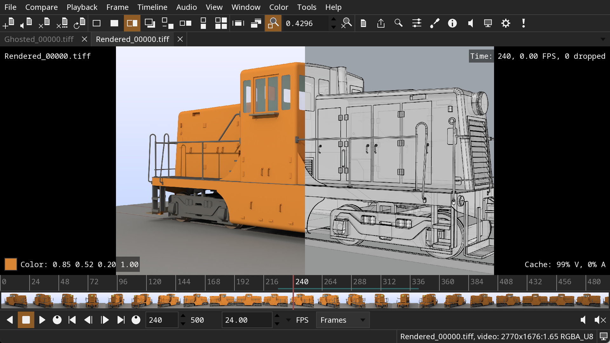
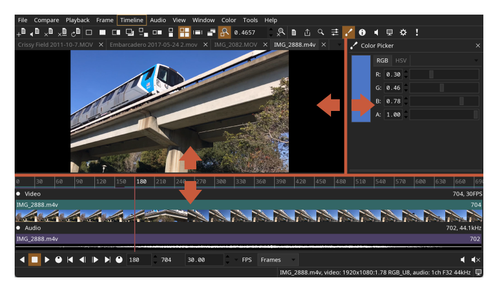
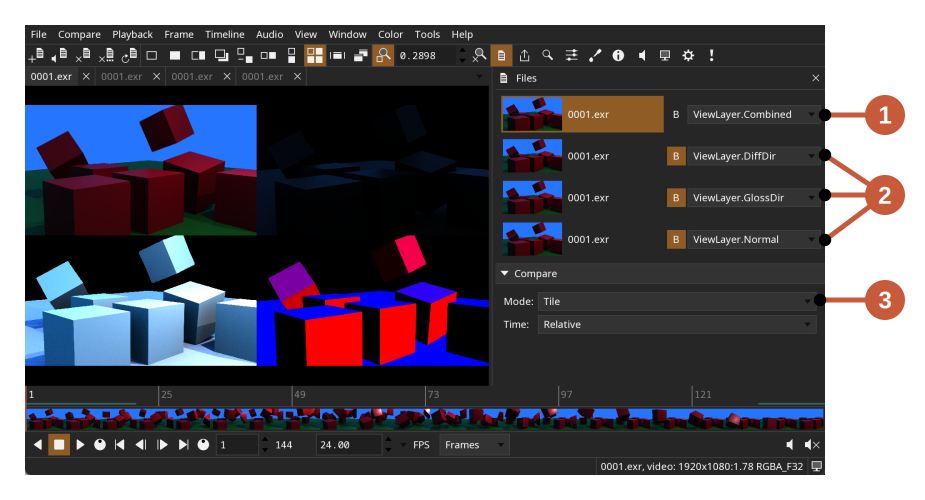
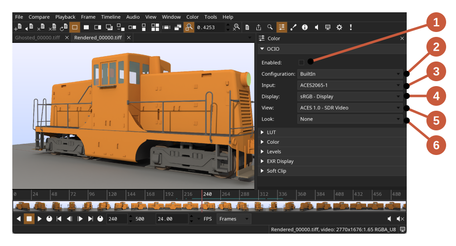
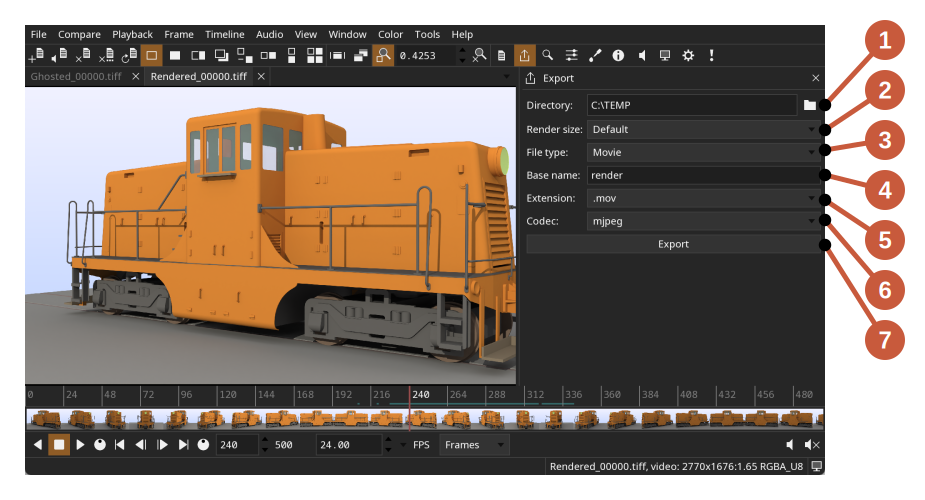
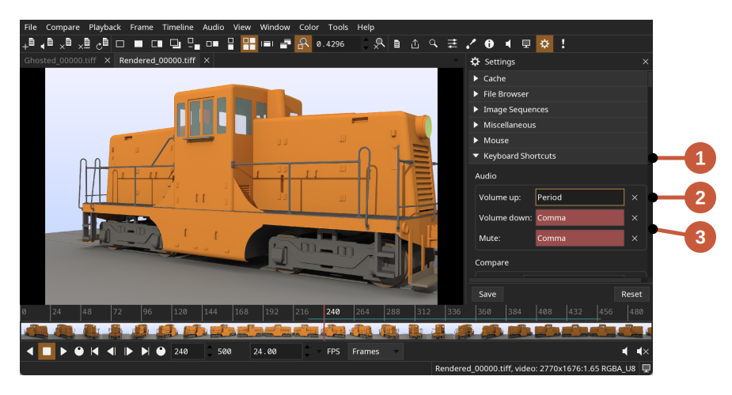

#  DJV

DJV is an open source application for playback and review of image
sequences. DJV can playback high resolution image sequences in real
time, with audio, A/B comparison, and color management.

Features include:
* Support for high resolution and high bit depth images
* A/B comparison with wipe, overlay, and difference modes
* Timeline support with OpenTimelineIO
* Color management with OpenColorIO
* Multi-track audio with variable speed and reverse playback
* Experimental support for USD files
* Available for Linux, macOS, and Windows

GitHub: https://github.com/darbyjohnston/DJV

<br>




<br><br>
### Documentation

1. [Download and Install](#install)
2. [Main Window](#main_window)
3. [Viewport](#viewport)
4. [Working with Files](#files)
5. [Playback and Frame Control](#playback)
6. [Timeline](#timeline)
7. [A/B Comparison](#compare)
8. [Color Controls](#color)
9. [Exporting Files](#export)
10. [Keyboard Shortcuts](#shortcuts)
11. [Settings](#settings)
12. [Building from Source](#build)


<br><br><a name="install"></a>
## Download and Install

**NOTE**: Download packages only include a minimal set of video and audio
codecs. To enable full support, either compile from source or replace the
FFmpeg shared libraries.

### Linux

Packages are distributed as tar archives. Uncompress the archive and move the
DJV folder to a convenient location.

### Windows

Packages are distributed as ZIP archives. Uncompress the archive and move the
DJV folder to a convenient location.

### macOS

Packages are distributed as macOS disk images. Open the disk image and copy
DJV to the Applications folder.

The first time DJV is started there will be an error about security; to fix
this open the security settings and click the **Open Anyway** button:


<br><br><a name="main_window"></a>
## Main Window


Main window components:
1. Menu Bar
2. Tool Bars
3. Tab Bar - Switch between currently opened files
4. Viewport
5. Timeline
6. Bottom Tool Bar
7. Tool Widget
8. Status Bar - Errors and information about the current file

Components can be toggled on and off from the **Window** menu.

Splitters can be used to change the size of the components:


Full screen mode can be enabled from the **Window** menu.

A secondary window can be shown to mirror the viewport on a separate monitor.
The secondary window can be shown from the **Window** menu.


<br><br><a name="viewport"></a>
## Viewport

The viewport shows a view of the current file. The view can be panned, zoomed,
or "framed" so the image fills the view.

Viewport controls:
* Pan - **Ctrl** + mouse click and drag
* Zoom - Mouse wheel or keyboard shortcuts **-** and **=**
* Frame view - Keyboard shortcut **Backspace**
* Wipe in compare mode - **Alt** + mouse click and drag
* Color picker - Mouse click
* Frame shuttle - Mouse click and drag

The viewport controls can be customized in the **Settings** tool.

The bit depth of the viewport can be set in the **View** tool with the buffer
type option. The value **RGBA_U8** will use an 8-bit buffer which is useful for
lower end GPUs. The values **RGBA_U16** and **RGBA_F32** will use 16-bit and
floating point buffers respectively.

The background color of the viewport can be set in the **View** tool. An
outline can also be drawn around the image to disinguish it from the
background, usefull for images with transparency.

### Grid

A grid can be enabled from the **View** tool.

One example of using the grid is for examining individual pixels:

1. Set **Minify** and **Magnify** to **Nearest**
2. Enable the grid
3. Set the grid size to one

### HUD

Information can be overlaid on the viewport by enabling the HUD (heads up
display). The HUD can be enabled from the **View** menu.


HUD components:
1. Current file name
2. Current frame
3. Playback speed
4. Number of frames dropped during playback
5. Color picker
6. Video cache usage
7. Audio cache usage


<br><br><a name="files"></a>
## Working with Files

Supported file formats:
* Image sequences: Cineon, DPX, JPEG, OpenEXR, PNG, PPM, SGI, TGA, BMP, TIFF
* Movie codecs: MJPEG
* Audio codecs: FLAC, MP3, WAV
* Timelines: OTIO, OTIOZ
* Experimental: USD

Files and folders can be opened from the **File** menu, by dragging and
dropping onto the main window, or from the command line. Opening a folder will
open all of the supported files in the folder (non-recursively).

The native file browser is enabled by default on Windows and macOS. The
built-in file browser can be enabled in the **Settings** tool.

The current file can be changed from the **File/Current** menu, the
**Tab Bar**, or the **Files** tool.

### Memory Cache

The memory cache can be configured in the **Settings** tool. There are
separate values for video, audio, and "read behind". The "read behind"
value is the number of seconds that are read before the current frame. This
is useful to ensure frames are cached when scrubbing.

Only the current file is stored in the cache. When the current file is
changed, it is unloaded from the cache and the new file is loaded.

### Layers

For files that contain multiple layers (i.e., OpenEXR), the current layer can
be changed from the **File/Layers** menu, or the **Files** tool.

### Files Tool

The **Files** tool can be used to set the current file, the current layers, and
compare options.

The **Files** tool can be shown from the **Tools** menu or the tool bar.


Files tool components:
1. The current, or **A**, file
2. The **B** file(s)
3. The current layer of the file
4. Compare mode
5. Compare time
6. Compare options

### Image Sequences and Audio

Audio can be added to image sequences either automatically or explicitly.

To automatically add audio to image sequences, open the **Image Sequences**
section in the **Settings Tool**. Audio files can be found by either specifying
the file extensions to search for (e.g., ".wav .mp3"), or providing a specific
file name.

To explicitly add audio to an image sequence use the
**File/Open With Separate Audio** menu.

### USD

There is experimental support for USD files. The USD file is rendered to an
image sequence with the Hydra renderer.

The camera used to render the scene, in order of priority:
1. If the USD file is referenced from an OTIO file, the name of the clip
2. The primary camera in the scene
3. The first camera found in the scene
4. A temporary camera is created that frames the scene


<br><br><a name="playback"></a>
## Playback and Frame Control

Playback and frame controls on the bottom tool bar:

1. Playback controls
2. Playback shuttle - Click and drag to change playback speed
3. Frame controls
4. Frame shuttle - Click and drag to change the current frame
5. Current frame
6. Duration
7. Current speed
8. Time units (frames, seconds, timecode)

In and out points can be set frome the **Playback** menu to limit playback to a
section of the timeline.

The number of dropped frames during playback can be viewed in the HUD, which is
available from the **View** menu.


<br><br><a name="timeline"></a>
## Timeline


Timeline components:
1. Current frame
2. Video cache display (green)
2. Audio cache display (purple)
3. Video track
4. Video clips
5. Audio track
6. Audio clips

Controls:
* Change the current frame - Mouse click and drag
* Zoom - Mouse wheel or keyboard shortcuts **-** and **=**
* Frame view - Keyboard shortcut **Backspace**
* Pan - **Ctrl** + mouse click and drag

The size of the timeline thumbnails can be set from the **Timeline** menu.
Thumbnails can also be disabled to improve performance.


<br><br><a name="compare"></a>
## A/B Comparison

To compare files, open both files and set the **B** file from either the
**Compare/B** menu or **Files** tool. The **A** file is the current file.

Compare modes:
* A - Show only the **A** file
* B - Show only the **B** file
* Wipe - Wipe between the **A** and **B** files
* Overlay - Show the **B** file over the **A** file
* Difference - Show the difference between the **A** and **B** files
* Horizontal - Show the **A** and **B** files side by side
* Vertical - Show the **A** and **B** files over and under
* Tile - Show the **A** and **B** files as tiles

Multiple **B** files can be viewed with **Tile** mode.

One example use for **Tile** mode is to simultaneously view multiple layers
within a file. Open the file multiple times and set the current layer for
each instance. Set one of the files as current, or the **A** file, and the
rest as **B** files, and enable **Tile** compare mode.


Compare multiple layers:
1. Set the current, or **A**, file and layer
2. Set multiple **B** files and their layers
3. Set the compare mode to **Tile**

Files can be compared in relative or absolute time mode. In relative time mode
the time of the **B** file will be offset to match the start of the **A** file.
In absolute time mode the **A** and **B** times will be the same.


<br><br><a name="color"></a>
## Color Controls

The **Color Controls** tool can be used to set OpenColorIO options, specify a
LUT (Look-Up Table), or apply other controls like brightness, contrast, and
levels.

The **Color Controls** tool can be shown from the **Tools** menu or the tool
bar.


OpenColorIO options:
1. Enable OpenColorIO
2. OpenColorIO configuration file
3. Input color space
4. Display color space
5. View color space

A LUT file can also be applied either before or after the OpenColorIO pass, by
setting the LUT **Order** option to **PreColorConfig** or **PostColorConfig**.


<br><br><a name="export"></a>
## Exporting Files

The **Export** tool can be used to export the current file as an image
sequence, a movie, or the current frame as a still image.

The **Export** tool can be shown from the **Tools** menu or the tool bar.


Export components:
1. Output directory
2. Render size
3. File type
4. Base file name
5. File extension
6. Movie codec

To export an image sequence set the file type to **Sequence**. To export the
current frame set the file type to **Image**.

Note that audio export is not yet supported.


<br><br><a name="settings"></a>
## Settings

Settings are stored as a JSON file in the **DJV** folder in your **Documents**
directory.

If the application gets into a bad state or fails to start, try resetting the
settings:
* Delete the settings file
* Or pass the **-resetSettings** flag on the command line


<br><br><a name="shortcuts"></a>
## Keyboard Shortcuts

Keyboard shorcuts can be customized in the **Settings** tool.

The **Settings** tool can be shown from the **Tools** menu or the tool bar.


Keyboard shortcuts components:
1. Keyboard shortcuts settings
2. Shortcut with keyboard focus
3. Conflicting shortcuts

To set a shortcut, click the shortcut widget or use the tab key to give it
keyboard focus, then type the new shortcut. The widget will turn red if the
shortcut conflicts with another one.


<br><br><a name="build"></a>
## Building from Source

A CMake "super build" script is provided to build DJV and all of the
dependencies.

### Building on Linux

Clone the repository:
```
git clone https://github.com/darbyjohnston/DJV.git
```
Run CMake with the super build script:
```
cmake -S DJV/etc/SuperBuild -B Release -DCMAKE_INSTALL_PREFIX=$PWD/Release/install -DCMAKE_PREFIX_PATH=$PWD/Release/install -DCMAKE_BUILD_TYPE=Release
```
Start the build:
```
cmake --build Release -j 4 --config Release
```
Run the application:
```
./Release/DJV/src/DJV-build/bin/djv/djv
```

### Building on macOS

Clone the repository:
```
git clone https://github.com/darbyjohnston/DJV.git
```
Run CMake with the super build script:
```
cmake -S DJV/etc/SuperBuild -B Release -DCMAKE_INSTALL_PREFIX=$PWD/Release/install -DCMAKE_PREFIX_PATH=$PWD/Release/install -DCMAKE_BUILD_TYPE=Release
```
Start the build:
```
cmake --build Release -j 4 --config Release
```
Run the application:
```
./Release/DJV/src/DJV-build/bin/djv/djv
```

The CMake variable `CMAKE_OSX_ARCHITECTURES` can be used to specify the build
architecture:
```
-DCMAKE_OSX_ARCHITECTURES=x86_64
```
```
-DCMAKE_OSX_ARCHITECTURES=arm64
```

These aliases are convenient for switching between architectures:
```
alias arm="env /usr/bin/arch -arm64 /bin/zsh --login"
alias intel="env /usr/bin/arch -x86_64 /bin/zsh --login"
```

### Building on Windows

Dependencies:
* Install MSYS2 (https://www.msys2.org) for compiling FFmpeg.
* Install Strawberry Perl (https://strawberryperl.com/) for compiling network support.
* Install Python 3.11 for compiling USD.

Clone the repository:
```
git clone https://github.com/darbyjohnston/DJV.git
```
Run CMake with the super build script:
```
cmake -S DJV\etc\SuperBuild -B Release -DCMAKE_INSTALL_PREFIX=%CD%\Release\install -DCMAKE_PREFIX_PATH=%CD%\Release\install -DCMAKE_BUILD_TYPE=Release
```
Start the build:
```
cmake --build Release -j 4 --config Release
```
Run the application:
```
set PATH=%CD%\Release\install\bin;%PATH%
```
```
.\Release\DJV\src\DJV-build\bin\djv\Release\djv
```
